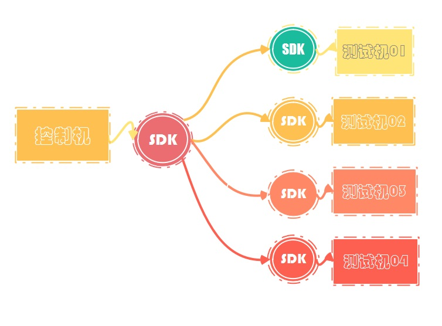
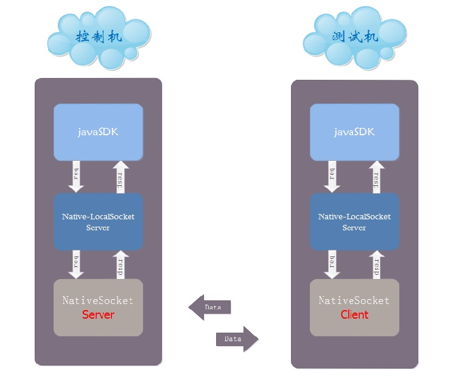
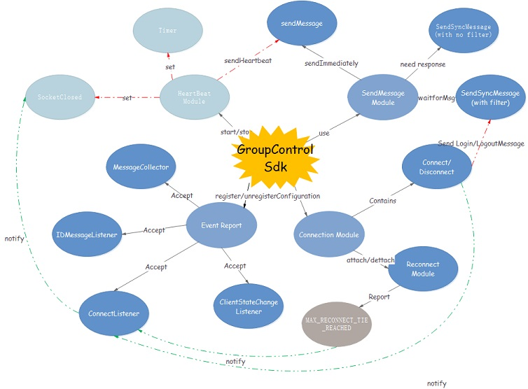

# Socket通讯V1.0

## 简介
用于群控项目，对应用层开发者提供通讯服务，方便应用开发者不需要过多关心下层数据的传输，提供非常精简的接口，让应用开发者只需要关心如何发送消息以及处理自己关心的消息；

## 平台架构

而sdk的封装由三层构成：

功能架构如下：

## 集成指南

### SDK导入
本Sdk分为两部分，groupcontrolservice负责本地socket的启动，停止等操作，作为一个单独的服务程序安装；用户可以通过在android studio导入源码或者直接安装服务程序apk的方式；
考虑到开发者的需求不一样，在下载的sdk中，提供了两种集成方式：

- 导入源码
- 导入jar包

sdk的源码分为两部分构成，c层的服务程序以及java层的sdk封装，因此需要导入两个module。在安装的时候也需要区分，首先安装groupcontrolservice，然后安装sdk所在的app应用；

### 第三方库介绍
本sdk中没有用到第三方库，全部采用原生api设计，因此不需要关心第三方依赖；

### 配置工程
在使用本Sdk的时候，需要进行适当的配置才能正常使用，因为在代码中使用到了一些需要权限的操作，所以我们需要在清单文件中声明所需要的权限；

    <uses-permission android:name="android.permission.INTERNET" />
    <uses-permission android:name="android.permission.WRITE_EXTERNAL_STORAGE"/>
    <uses-permission android:name="android.permission.READ_PHONE_STATE"/>

## SDK基础功能

### 取本地log
以Demo为例，获取本地的log

    adb pull /sdcard/SkyRuler/logs/log-2018-09-07.log

需要注意的是，每一天的日志会保存到同一个文件中，在获取日志的时候只需要指定日期即可获取到当天app运行的所有日志；
当然，在调试模式中是不会输出日志到文件中的，调试过程中的日志会直接通过Log.i的形式打印在控制台，所以在调试过程中查看日志需要在Android studio的logcat中查看；

### 初始化 SDK
建议在 application 的oncreate方法中做初始化，当然你也可以选择在其他地方初始化，在初始化的时候需要传入两个参数：context以及设置好的 options；

     //获取ClientID，这个参数作为唯一的标识被远程服务器识别
     String clientID = DeviceInfoUtils.getDeviceInfo(mContext);
     ConnectOption option = new ConnectOption.Builder(clientID)
                    //设置连接超时时间，可选
                    .setConnectTimeout(30)
                    //设置最大重连次数，可选，默认为4
                    .setReconnectMaxAttemptTimes(4)
                    //设置心跳频率，可选，默认为10*1000ms
                    .setPulseFrequency(10 * 1000)
                    //设置是否容许重连，可选，默认false
                    .setReconnectAllowed(true)
                    //设置重连间隔，可选,默认5*1000ms
                    .setReconnectInterval(10*1000)
                    //是否是调试版本，可选,默认是false
                    .setDebug(false)
                    .build();
     //必须设置：isServer，本地SocketName（必须和启动LocalService时候传入一致）
     SocketConfiguration config = SocketConfiguration.Builder(false,"GroupControl")
                    //连接选项，如上配置，可选
                    .setSkSocketOption(option)
                    //本地socket命名空间，可选
                    .setNameSpace(LocalSocketAddress.Namespace.ABSTRACT)
                    .build();
     ServerSdk.setup(mContext, config);
     //获取到Sdk接口的实例
     skClient = ServerSdk.getInstance();
     //添加连接监听，不添加无法获取连接状态
     skClient.addConnectListener(this);
     //控制机配置，添加客户端状态改变监听，测试机不需要配置
     skClient.addClientStateCallback(this);

**注意**，如果是服务端(控制机),需要在登录成功后添加客户端(测试机)状态改变监听;

### 连接&登录
对于app开发者来说，连接和登录是一个操作，都是调用sdk的connect方法：

    skClient.connect();

在调用登录方法后，sdk会根据配置连接到LocketSocket。如果是测试机端，则会自动连接到远程的控制机，这个过程app开发者不需要关心，在连接成功或者失败的时候，会通过前面配置的addConnectListener回调连接状态，这个连接状态码如下

    /**
     * 连接成功
     */
    int STATE_CONNECT_SUCCESSFUL = 1;
    /**
     * 连接服务器或者初始化流失败
     */
    int STATE_CONNECT_FAILED = 2;
    /**
     * 主动断开
     */
    int STATE_SOCKET_CLOSE_SUCCESSFUL = 3;
    /**
     * 被动断开,异常断开
     */
    int STATE_SOCKET_CLOSE_UNEXCEPTED = 4;
    /**
     * 达到最大重连次数
     */
    int STATE_REACH_MAX_RECONNECT_TIME = 5;

    /**
     * 连接成功但是登录超时
     */
    int STATE_LOGIN_TIMEOUT = 10;
    /**
     * 连接成功但是被拒绝了
     */
    int STATE_LOGIN_REFRUSHED = 11;

app开发者可以根据状态码的不同做相应的处理，其中需要注意的是，回调的状态码是STATE_CONNECT_SUCCESSFUL的时候，表示已经连接成功，那么就可以执行接下来的操作了，比如我要添加指定MessageID的消息：

### 消息监听

    skClient.addMessageListener(ServerActivity.this, new MessageIdFilter((ExampleTextMessageBody.ID)));

上面就添加了一个messageId为ExampleTextMessageBody.ID的消息监听，开发者再添加监听的时候需要添加两个参数，第一个是用来接收回调消息的listener，第二个是指定消息的过滤器，这里是构建了一个msgID为ExampleTextMessageBody.ID的过滤器；

